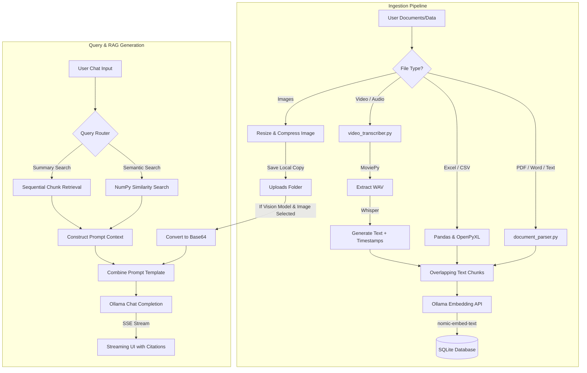

# Local Multimodal RAG Platform

[](https://www.python.org/)
[](https://fastapi.tiangolo.com/)
[](https://ollama.com/)
[](https://opensource.org/licenses/MIT)

A fully local, private, and production-ready **Retrieval-Augmented Generation (RAG)** application. Upload documents, spreadsheets, images, audio, or video files and chat with them entirely on your machine. Powered by **FastAPI**, **SQLite**, **NumPy**, and **Ollama**, this platform ensures complete data privacy with zero external API dependencies or costs.

---

##  Key Features

*   **100% Local & Private**: All data processing, vectorization, and generation happen locally on your hardware.
*   **Multimodal (Vision) RAG**: Chat about images (`.png`, `.jpg`, `.jpeg`, `.webp`) using vision models like `moondream` or `llava`. Images are compressed and resized on the fly to optimize local VRAM usage.
*   **Audio/Video Transcription**: Ingest `.mp4`, `.mp3`, `.wav`, `.m4a`, and other media files. The system automatically extracts audio tracks using `moviepy`, transcribes them with `openai-whisper`, and formats chunks with temporal timestamps (e.g., `[01:23 - 02:05]`) for time-based RAG queries.
*   **Broad Document Support**: Native ingestion for PDFs, Word files (`.docx`), Excel sheets (`.xlsx`, `.xls`), CSVs, Markdown, JSON, XML, and log files.
*   **NumPy-powered Vector Search**: SQLite stores serialized embeddings, and cosine similarity is calculated in-memory using NumPy for maximum local lookup speed without setting up a heavy vector database.
*   **Smart Context Routing**: 
    *   *Semantic Queries*: Uses vector database similarity search to find the top $k$ relevant chunks.
    *   *Summary Queries*: Automatically detects overview/summary intents and feeds sequential chunks from the start of the document for context.
*   **Dynamic Model Management**: Pull models directly from the web dashboard and switch between text, embedding, and vision models on the fly.
*   **Sleek User Interface**: Modern dark-themed dashboard featuring real-time Server-Sent Events (SSE) streaming responses, session management (create, delete, and switch chats), interactive citation previews, and side-panel document trackers.

---

##  System Architecture

The following diagram illustrates the document processing, vector search, and query generation pipelines:



---

##  Tech Stack

*   **Backend Framework**: [FastAPI](https://fastapi.tiangolo.com/) (Python 3.8+)
*   **Dev Server / ASGI**: [Uvicorn](https://www.uvicorn.org/)
*   **Database**: [SQLite3](https://www.sqlite.org/) (handles documents metadata, chunk vectors, sessions, and messages)
*   **Vector Operations**: [NumPy](https://numpy.org/) (vectorized cosine similarity calculations)
*   **Parsing & Extraction**:
    *   PDFs: `pypdf`
    *   Word Documents: `python-docx`
    *   Spreadsheets & DataFrames: `pandas`, `openpyxl`
    *   Audio Transcription: `openai-whisper`
    *   Video Audio Extraction: `moviepy`
    *   Image Processing: `pillow`
*   **Local Inference Host**: [Ollama](https://ollama.com/)
*   **Frontend**: Custom HTML5, Vanilla CSS3 (Glassmorphism UI), and JavaScript (SSE connection, session handlers, and UI bindings)

---

##  Setup & Installation

### 1. Prerequisites
*   Python 3.8 or higher.
*   **Ollama** installed and running on your local machine. Download it from [ollama.com](https://ollama.com/).
*   *(Optional)* FFmpeg installed (required by `moviepy`/`whisper` for processing video and audio files).

### 2. Install Dependencies
Clone this repository and install the required Python packages:
```bash
pip install -r requirements.txt
```

### 3. Pull Required Ollama Models
Before starting, pull your choice of embedding, text, and vision models. For instance:
```bash
# Pull the default embedding model
ollama pull nomic-embed-text

# Pull a lightweight LLM for general chat
ollama pull llama3

# Pull a vision-enabled model for chatting with images
ollama pull moondream
```

### 4. Run the Application
Start the Uvicorn server:
```bash
python main.py
```
Or use the direct Uvicorn command:
```bash
uvicorn main:app --host 127.0.0.1 --port 8000 --reload
```
Open your browser and navigate to **`http://127.0.0.1:8000`** to access the dashboard.

---

##  Project Structure

```text
├── database.py             # SQLite schema design, connection, & similarity search logic
├── document_parser.py      # Extracts content and chunks text/data files
├── video_transcriber.py    # Extracts audio and runs Whisper transcriptions
├── main.py                 # FastAPI application routes, Ollama client wrapper, & SSE streaming
├── requirements.txt        # Project dependencies
├── test_rag.py             # Unit tests for chunking, DB ops, and NumPy similarity math
├── static/
│   ├── css/
│   │   └── style.css       # Custom Glassmorphic CSS style definitions
│   └── js/
│   │   └── app.js          # Core frontend application state, DOM handlers, & network clients
├── templates/
│   └── index.html          # Main HTML structure rendered via Jinja2
└── uploads/                # Stores uploaded documents and processed images
```

---

##  Running Tests

The project includes unit tests covering the text chunking mechanism, database persistence operations, and the NumPy cosine similarity logic.

Run the test suite using `unittest`:
```bash
python -m unittest test_rag.py
```

---

##  Recommended Models

For the best experience, we suggest the following local models:

| Task Type | Recommended Model | Command | Notes |
| :--- | :--- | :--- | :--- |
| **Embeddings** | `nomic-embed-text` | `ollama pull nomic-embed-text` | High-quality 768-dimension local embeddings. |
| **Standard LLM** | `llama3` / `mistral` / `phi3` | `ollama pull llama3` | Excellent reasoning for general document retrieval. |
| **Vision/Multimodal** | `moondream` / `llava` | `ollama pull moondream` | `moondream` is small, fast, and highly efficient. |

---

##  License

This project is licensed under the MIT License. See [LICENSE](LICENSE) for details.
